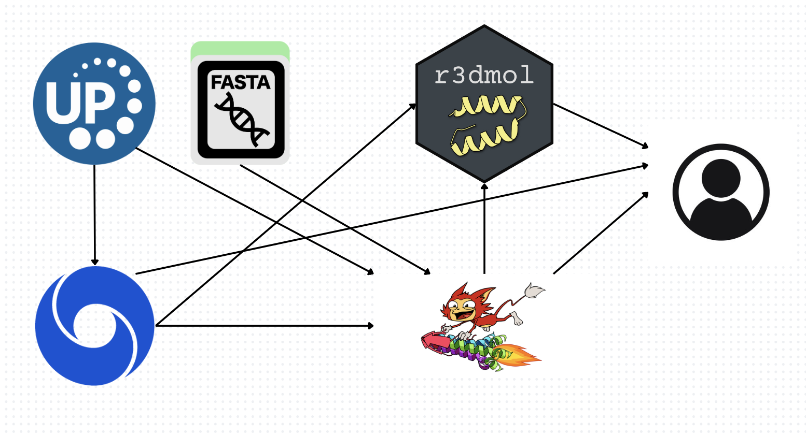

<!-- README.md is generated from README.Rmd. Please edit that file -->

```{r, include = FALSE}
knitr::opts_chunk$set(
  collapse = TRUE,
  comment = "#>",
  fig.path = "man/figures/README-",
  out.width = "100%"
)
```

# foldSeekR

<!-- badges: start -->
<!-- badges: end -->

## Description

`foldSeekR` is an R package designed to streamline protein structure predictions via AlphaFold (https://alphafold.ebi.ac.uk/) and architecture comparisons via FoldSeek (https://www.foldseek.com). foldSeekR uses Uniprot accession ID's or FASTA files or strings to search structure similarities on AlphaFold. It uses FoldSeek to query the AlphaFold database for the most similar protein architectures to the protein structure of interest. It provides visualization of the protein of interest and the similar proteins with highlighted regions similar to the target protein.

`foldSeekR` was developed using:

```
R version 4.4.1 (2024-06-14)
Platform: aarch64-apple-darwin20
Running under: macOS Sonoma 14.6.1
```

## Installation

To install the latest version of the package:

``` r
require("devtools")
devtools::install_github("bellabr/foldSeekR", build_vignettes = TRUE)
library("foldSeekR")
```

To run the shinyApp: 

``` r
runFoldSeekR()
```

## Overview

``` r
ls("package:foldSeekR")
browseVignettes("foldSeekR")
```

`foldSeekR` contains 3 functions in the current version.

- `pull_prediction` for pulling protein architecture prediction information from AlphaFold including sequential information.

- `pull_summary` for pulling protein summary information from AlphaFold including Uniprot information and structural information.

- `pull_url` for retrieving the links to downloadable data files (PDB, CIF, or mmCIF) for the specified accession.

- `available_databases` for retrieving the databases available to be searched for structure similarity.

- `ticket` for submitting a FoldSeek job and retrieving a ticket.

- `status` for checking the status of the job submission.

- `foldseek` for submitting a job, handling the ticket, and retrieving information from the search query.

- `cache_top_hits` for caching a number of top hits with respect to sequence similarity for later use.

- `clear_cache` for clearing the cache for a given accession thread.

- `visualize_prediction` for producing an interactive and colourful visualization of the protein of interest.

- `visualize_foldseeks` for producing an interactive and colourful visualization of the protein of interest compared to the cached top hits for similar proteins in structure. The visualizations are side-by-side and interact together, in addition to being colour-coded by each region of similarity to the target protein of interest.

Refer to package vignettes for more details.

An image outlining the workflow of foldSeekR is illustrated below.



## Contributions

The author of the package is Annabella Bregazzi. 

The author wrote the pull_prediction function, which makes use of httr2, jsonlite. 

The author wrote the pull_summary function, which makes use of httr2, jsonlite. 

The author wrote the pull_url function, which makes use of httr2, jsonlite. 

The author wrote the available_databases function, which makes use of httr2, jsonlite. 

The author wrote the ticket function, which makes use of httr2, jsonlite, curl. 

The author wrote the status function, which makes use of httr2, jsonlite. 

The author wrote the foldseek function, which makes use of httr2, jsonlite. 

The author wrote the cache_top_hits function, which makes use of BiocFileCache. 

The author wrote the clear_cache function, which makes use of BiocFileCache. 

The author wrote the visualize_prediction function, which makes use of BiocFileCache, r3dmol, bio3d. 

The author wrote the visualize_foldseeks function, which makes use of BiocFileCache, r3dmol, bio3d. 

No generative AI tools were used in the development of this package.

## References

- Barrio-Hernandez, I., Yeo, J., Jänes, J., Mirdita, M., Gilchrist, C.L.M., Wein, T., Varadi, M., Velanka, S., Beltrao, P., and Steinegger, M (2023). Clustering predicted structures at the scale of the known protein universe. *Nature* 622: 637-645. https://doi.org/10.1038/s41586-023-06510-w.

- Grant B, Rodrigues A, ElSawy K, McCammon J, Caves L (2006). “Bio3D: An R package for the comparative analysis of protein structures.” Bioinformatics, 22, 2695–2696.

- Jumper, J. et al. “Highly accurate protein structure prediction with AlphaFold.” *Nature*, 596, pages 583–589 (2021). DOI: 10.1038/s41586-021-03819-2.

- van Kempen, M., Kim, S.S., Tumescheit, C., Mirdita, M., Lee, J., Gilchrist, C.L.M., Söding, J., and Steinegger, M (2024). Fast and accurate protein structure search with Foldseek. *Nature Biotechnology* 42: 243-246. https://doi.org/10.1038/s41587-023-01773-0.

- Kim, W., Mirdita, M., Karin, E.L., Gilchrist, C., Schweke, H., Söding, J., Levy, E., and Steinegger, M. (2024). Rapid and Sensitive Protein Complex Alignment with Foldseek-Multimer. *bioRxiv* 2024.04.14.589414. https://www.biorxiv.org/content/10.1101/2024.04.14.589414v1.

- Ooms J (2024). curl: A Modern and Flexible Web Client for R. R package version 6.0.2, https://github.com/jeroen/curl.

- Ooms J (2014). “The jsonlite Package: A Practical and Consistent Mapping Between JSON Data and R Objects.” arXiv:1403.2805 [stat.CO]. https://arxiv.org/abs/1403.2805.

- Shepherd L, Morgan M (2024). BiocFileCache: Manage Files Across Sessions. R package version 2.14.0.

- Su W, Johnston B (2023). r3dmol: Create Interactive 3D Visualizations of Molecular Data. R package version 0.2.0, https://github.com/swsoyee/r3dmol.

- Varadi, M. et al. “AlphaFold Protein Structure Database: massively expanding the structural coverage of protein-sequence space with high-accuracy models.” *Nucleic Acids Research*, 50(D1), pages D439–D444 (2021). DOI: 10.1093/nar/gkab1061

- Varadi, M. et al. “AlphaFold Protein Structure Database in 2024: Providing structure coverage for over 214 million protein sequences.” *Nucleic Acids Research*, gkad1011 (2023). DOI: 10.1093/nar/gkad1011

- Wickham H (2024). httr2: Perform HTTP Requests and Process the Responses. R package version 1.0.6.9000, , https://github.com/r-lib/httr2.

## Acknowledgments

This package was developed as part of an assessment for 2024 BCB410H: Applied Bioinformatics
course at the University of Toronto, Toronto, CANADA. `foldSeekR` welcomes issues,
enhancement requests, and other contributions. To submit an issue, use the GitHub issues.
